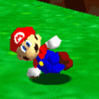

# Mario Colors Challenge

[PT](#reconhecimento-de-voz-com-javascript) / [EN](#speech-recognition-with-javascript)

<h1 align='center'><a href='https://juliana-happatsch.github.io/mario-colors'>🍄 Link 🍄</a></h1>

---
# Reconhecimento de Voz com JavaScript

## Sumário
- [Sobre](#sobre)
- [Tecnologias](#tecnologias)

---

### Sobre
O **Mario Colors Challenge** é um mini jogo com tema de Super Mario para a pessoa usuária poder treinar sua pronúncia e vocabulário em inglês. Meu primeiro projeto usando reconhecimento de voz e segui a aula do [Felipe Aguiar](https://github.com/felipeAguiarCode) no Digital Innovation One.

Espero que goste!!

### Tecnologias
- HTML
- CSS
- JavaScript

---

# Speech Recognition With JavaScript

## Sumário
- [About](#about)
- [Technologies](#technologies)

---

### About
**Mario Colors Challenge** is a mini game with Super Mario theme where the users can practice their English pronunciation and vocabullary. It's my first project using speech recognition and I made it following [Felipe Aguiar](https://github.com/felipeAguiarCode)'s class in the DIO website.

I hope you like it!!

### Technologies
- HTML
- CSS
- JavaScript

 

